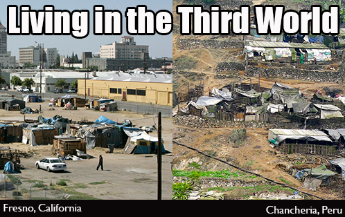
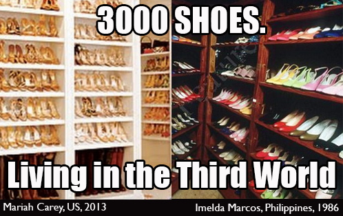

Sometimes today when I read news stories or see headlines contrasting images flash in my mind. The stark contrast of rich and poor in the United States today often feels like living in the third world, as I remember it as a kid living in El Salvador and the Philippines. I’ve captured a few of these, in style of the Internet meme, which tell the story in a way that is perhaps more accessible that the numbers used by the economists.

Fresno image via Salon article via [No, poverty is not the fault of the poor](https://www.salon.com/2013/09/10/no_poverty_is_not_the_fault_of_the_poor_partner/)  
Chancheria via [Mission Meanderings](http://missionmeanderings.com/2012/10/), blog of Rev. Canon Dr. Ian Montgomery

On the other side, looking at the very rich, Imelda Marcos made headlines with her [3000 pairs of shoes left behind](http://www.dailymail.co.uk/news/article-2207353/Imelda-Marcos-legendary-3-000-plus-shoe-collection-destroyed-termites-floods-neglect.html) when she and her husband fled the Philippines in 1986. Here in the US, [celebrity closets tell a similar tale](http://www.mamamia.com.au/style/celine-dion-has-3000-pairs-of-shoes-you/) “Mariah Carey has also admitted to owning between 2000 and 3000” pairs of shoes, and Linday Lohen reportedly has 5000.

For those who might feel that this is emotional hyperbole, there’s data tracking this very real trend. Economists quantify the gap between rich and poor with something called the [GINI index](http://en.wikipedia.org/wiki/Gini_coefficient), which is getting worse in the US, while getting better in El Salvador. (In the graphs below, a lower number is better.)

<figure class="wp-caption thumbnail alignleft" id="attachment_4831" style="width: 242px;"> <figcaption class="wp-caption-text">Gap between rich and poor is increasing in the US since the 70s</figcaption></figure><figure class="wp-caption thumbnail alignleft" id="attachment_4835" style="width: 306px;"> <figcaption class="wp-caption-text">GINI index shows that the gap between rich and poor in El Salvador is decreasing in past decade.</figcaption></figure>What I Remember…
----------------

I was in 4th and 5th grade when I lived in the Philippines and El Salvador. I saw extreme poverty, where public schools lacked books, where children and sick people begged on the street. In the Philippines, we travelled to rural areas where I saw people who worked in rice fields and live in huts on stilts. Their children were skinny, but not starving. That was the middle class. In Manilla, the Americans and very rich, lived in a walled city around or near the army base. We went there for Halloween, and the poor kids would sneak in and try to get candy from the rich houses. One of the moms told me she only gave candy to kids in costume, since she didn’t want to encourage that kind of behavior. I wondered why I was allowed to get free candy and these other kids couldn’t. Would it be okay if they came back next year in costume, pretending not to be so poor and hungry?

In El Salvador, there was a soccer field near my house, and up the hill beyond an overgrown area, in the shadow of the Sheraton Hotel, there was a place where people lived packed together in little shacks made of metal roofing material with no running water or electricity. We didn’t live behind walls in air-conditioned houses as some of my friends did, but we were members of the Brittish-American club down the street where we could swim in the pool. Sometimes, I would see kids my age with dark hair and wide brown eyes peering over the wall at the pale kids splashing each other with moms sitting in the sunshine with their big sunglasses and iced drinks.

One day my mom came home from the bank. I think she was in shock, because she told me she had just seen someone shot by the police. “Because they were poor,” she told me. Perhaps oversimplifying the situation, perhaps not.

When I came back to the United States, I was acutely aware of how privileged I was, how wealthy my family, relative to many of the people of the world, despite being middle class in America.

And now?
--------

In the intervening years, I’ve seen my country decline for the majority of the population, while the rich become richer. I hope that by illustrating this contrast, or lack of contrast, between these worlds, more people will see what is happening around us. With awareness, I hope we can work together to change it.

In my little corner of the world, I’m volunteering in way that I believe makes a difference. I think government policies could have more of an impact, but that’s not really my area of expertise, so I focus on education, where individual effort can have significant impact. I do this work with [Bridge Foundry](http://bridgefoundry.org/) and its related volunteer initiatives. If you see the same trends that I do, and you have a job or have skills to share, get involved. Make a difference.