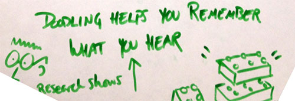
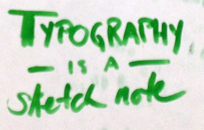

Did you know we each have our own, personal visual language? With a little practice, we can learn to extend our own personal style to communicate in an approachable way that conveys meaning at a glance.

At [She’s Geeky](http://shesgeeky.org/) this year, I attended a session taught by Alexis Finch ([@agentfin](https://twitter.com/agentfin)), well-known for her [sketch notes](http://graphitemind.com/). From my personal perspective, studying visual art alongside computer science in college, there was a time when I could render beautiful imagery in charcoal or oils. I even used to develop cartoon faces of my colleagues. However, being able to communicate visually in a business setting is a different skill, and I never thought it would be worth my time to develop such a skill. In just an hour, Alexis convinced me along with many folks who would never self-identify as artists that this was already within our reach.

She started by asking each of us to remember a time before we learned to write, when the act of writing itself, forming letters, was actually drawing. What was it we drew then? Or later, what was the thing or pattern that we drew in the margins of our notebooks at school. What do we doodle when we’re on the phone?

Research actually supports what I’ve found to be true in my own experience. In a [2009 Applied Cognitive Psychology study](http://pignottia.faculty.mjc.edu/math134/homework/doodlingCaseStudy.pdf), Jackie Andrade studied pure doodling while listening to boring material. “Unlike many dual task situations, doodling while working can be beneficial…The doodling group performed better on the monitoring task and recalled 29% more  
information on a surprise memory test.” I would guess that doodling as a way to reproduce significant points from something you would want to remember would have much higher impact.

We spent a few minutes doodling. I was delighted to see the variety of pattern and shape. I suddenly recalled that moment in elementary school when it seemed that everyone learned to draw puffy letters all at once, and someone’s signature cat reminded me of the bunny that I would faithfully reproduce at Easter. From precise curves to bubble-circle shapes, every individual demonstrated that they already had their own, very personal, visual language.

Next, Alexis taught us to [draw a dinosaur](http://sketchnotearmy.com/blog/2012/5/30/alexis-finch-teaches-us-how-to-draw-a-dinosaur.html) in 9 easy steps. Miraculously we were all competently rendering a quick sketch of this funny creature. In this class we learned simple recipe-like techniques for little drawings and how to combine them to convey meaning.

<figure class="wp-caption thumbnail aligncenter" id="attachment_4982" style="width: 500px;"><figcaption class="wp-caption-text">This “magical arrow” pointing to a word or with a word next to it will draw attention to some part of your notes.</figcaption></figure>Typography, or whatever you call it when you are drawing letters, is a very simple way of creating a sketch. You can pick out individual words that catch your attention and then arrange them in a sketch. This way you don’t actually have to remember a full quote to represent the meaning that was significant to you. You can use cursive, block letters, variation in capitalization and different aspect ratios to convey a feeling.

Humans have evolved to respond to faces.

<figure class="wp-caption thumbnail aligncenter" id="attachment_4993" style="width: 400px;"> <figcaption class="wp-caption-text">We learned simple techniques to produce faces that convey emotion.</figcaption></figure>I don’t know if my brief notes here convey the power of this technique. I hope some readers will be inspired to experiment. I will there were a visual language dictionary, where we could all follow simple recipes to empower visual communication.

Check out additional sketches from [Thinking Visually session notes](http://shesgeeky.org/notes-day-2-thinking-visually/).