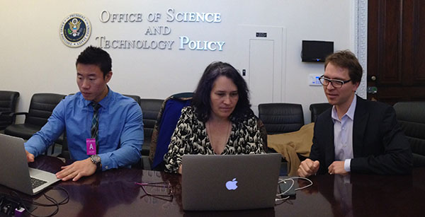

I was a Presidential Innovation Fellow in 2013, part of Round 2. I was recently asked what is it like day-to-day? This is based on my own personal experience. Note that the day-to-day was very different for fellows in more business-focused roles. Our group had fellows who had very different initiatives, like optimizing how our government invests or [working to secure industry support for open data](http://www.whitehouse.gov/blog/2014/02/07/leading-pharmacies-and-retailers-join-blue-button-initiative). My day-to-day experience is most relevant to folks with a deep technical, design or product background, but some of the general takeaways may be interesting to anyone considering [applying](http://www.whitehouse.gov/innovationfellows).

### Working at an Agency

Every Presidential Innovation Fellow actually works for a specific agency (or other governmental organization) on a specific project. The projects are designed to be ambitious and broadly defined in an area where President Obama, his staff and the agency believe that innovation can and will make a big difference. Agencies actually compete for the opportunity to be a part of this program. For my fellowship, I worked for the Smithsonian Institution as part of the White House Open Data Initiative (there were 14 of the 43 fellows who were focused on open data, which was a pretty big deal last year and still is). Since Open Data was so big, we were split up into “themes” and Smithsonian was grouped with NSF and Dept of Ed.

### Teams include Fellows and Agency Partners

I was part of a group of 3 fellows at the Smithsonian, working closely with their core tech team (which they call OCIO, Office of the Chief Information Officer — lots of acronyms in government). [Jason Shen](http://www.jasonshen.com/) and I worked on a [crowdsourced transcription website](https://transcription.si.edu/), and [Diego Mayer-Cantu](http://newsdesk.si.edu/photos/diego-mayer-cantu) worked on accelerating digitization, which was related to our work but not working with us every day. The two Presidential Innovation Fellows at Dept of Ed worked one block away — we had one official meeting with them in the summer, but brainstormed a lot informally at times. The NSF Fellow, [Bev Woolf](https://www.cs.umass.edu/faculty/directory/woolf_beverly), is this amazing women who was a CS Professor from UMass, who I had dinner with whenever I was in town since I was just so inspired by her personally. She got her PhD when I was still an undergrad. She is full of energy and passion to bring proven education teaching methodologies (funded by our tax dollars) to students, making private industry aware of NSF-funded research. I helped brainstorm how she might facilitate an event she was planning.

Often the Fellows, helped each other, since we each have different deep expertise, and no one is expert at everything. In many ways, we served as a cross-agency pool of expert knowledge and skills. For example, Michele Hertzfeld at Dept of Interior and Mollie Ruskin at Veterans Affairs designed some compelling visualizations with agency open data and I helped craft some code to bring those to life along with some other Fellow devs in little mini-hackathons where we helped each other. Marty Ringlein did some compelling design mockups for a Smithsonian project that helped us communicate our vision. Through our network, our agencies could draw upon a talent pool that tapped into private sector resources, as well as sometimes hidden resources within other agencies.

### Shared Fellowship

We spent about 80% of our time working at our agencies and 20% on broader initiatives. Every Tuesday we would all meet at the GSA headquarters, which is just an office building near the White House. Sometimes we would have speakers from government, sometimes from industry, sometimes we would pitch to each other about our successes and challenges, and then whoever was up for it would go out for dinner or drinks after. I found those Tuesday afternoons and evenings to be incredibly helpful opportunities for informal strategy meetings about how to cope with the strange world of government. Through each other’s stories we learned tips and tricks of how to get things done or just supported each other through some dark times and, of course, celebrated our wins, which were few at the beginning and fast and furious toward the end.

### Helping with Policy

We also spent a couple of hours in policy meetings on Tuesdays. These were sometimes long boring meetings, but I felt this was some of the most important work of our fellowship. Not every project had this component, but we were helping to define the [implementation guidelines of the open data policy](http://project-open-data.github.io/). I don’t know if our government had previously done policy documents using an open source processs. (We used github’s shared editing and pull requests.) This was certainly new to many on our policy team. I did a minor pull request to help with formatting, where a document seemed to have been written by someone unfamiliar with markdown. I also chimed in on some “issues” about the definition of data and how to handle formatting of the data itself and the metadata which describes it. We also talked through what was to me some fairly basic tech stuff interpreting what exactly does it mean to open data that is sitting as Excel spreadsheet on a hard drive or is already published through an API, but not yet on [data.gov](http://www.data.gov/). We really needed the mix of people who can write policy documents and tech folks who implement that policy working together as stakeholders, along with folks with industry business experience who were used to talking about using open data to solve business problems and connecting with private industry folks who might care.

### Day-to-Day Work

At the Smithsonian, we met every 2-4 weeks with a “working group” who were the internal stakeholders for the website we were working on. (Other Fellows had to assemble a working group or just worked with individual stakeholders in whatever way they thought made sense.) Every agency is a little different in how they like to work and part of the job is figuring that out and deciding when to assimilate and when to disrupt. It’s a little weird because you have no real power, but you have this important title and you can almost always get a first meeting with anyone. If you need to collaborate with people you can’t reach, you have support from folks in the White House who have the power to schedule a meeting that everyone will attend. That convening power can be pretty awesome, but most of your influence is earned by actually doing stuff that has value to your agency, whether its writing code, creating designs, writing documents, holding hackathons, or whatever.

Jason and I fell into a weekly pattern that we made up. We decided to send weekly metrics to our working group and the dev team. We tried to ship every couple of weeks, but more often we did other activities that had an impact on software usage — social media, emails to users, Jason put together a few online events. He did most of the UI mockups, and often we would tag-team design or collaborate on a whiteboard. I wrote some code, adding specific features or fixing bugs, but spent more time writing words and talking to people than coding. The goal was really culture change, not simply producing a piece of software. We wanted this to be a project that would live on after we left, and it was a Smithsonian goal as well. We hoped that they would also adopt some of the methodologies, and some have continued since we left.

### Special Projects

We were also encouraged to take on projects on our own initiative that weren’t directly related to our main project. For us, that was the first ever [Smithsonian Hackathon](http://americanart.si.edu/luce/hack/), which was pretty awesome. The Dept of Ed Fellows put together the first ever [White House Student Film Festival](http://www.whitehouse.gov/filmfestival), also awesome.

### Reflections

Overall it was an amazing, life-changing experience. There were moments, especially in the middle months, when I wondered whether we would really ever do anything meaningful, that I would end up with a fancy title that represented a series of futile meetings and random activity that didn’t go anywhere. As it turned out, I know we made a huge impact, it was just hard to see it until we got through it. And the truth is, I will never really know which things I did had a big impact and which didn’t. I just know some of them did.

It was strange at times, since it wasn’t clear who to take direction from. We didn’t interact every day with US CTO Todd Park, and certainly not the President or even anyone from the White House. Sometimes we needed to convince our direct supervisors at our agencies to do something that was unexpected and not part of their plan. As Presidential Innovation Fellows, we worked for the American People. Everyone had a strong mission to make an impact, to find the shortest path to effective change, creating services that saved money, created jobs or saved lives. There was an urgency which is not part of what most people expect from government work, but stems from the realization that if we don’t fix some of our government tech problems now, costs will get even more out of control and fewer things will actually work. Technology is only part of the solution, but it can certainly be applied more effectively that what we see happen in most government tech projects. We can leverage technology to make government work at the speed of the electron, when that is merited, and to allow people to make better decisions with the right information at their fingertips. There is an opportunity to do inexpensive interventions that will create lasting change.