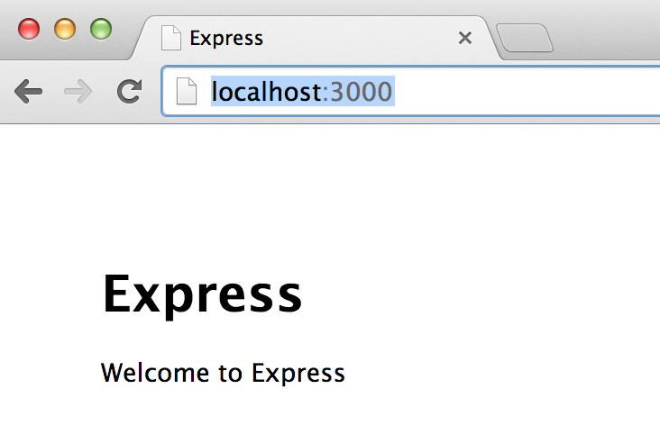

It has been surprisingly hard to find a very simple tutorial to get started with Express, along with some common helpful tools, including tests!

Here’s a little tutorial for Node.js v0.10 and Express 4. I’m learning Express, since I’m working on an app in SailsJS, so I will pick options that mirror choices made by the SailsJS framework.

### Install Express

Express is a popular simple web app framework for Node (similar to Sinatra for Ruby), and is easily instally with the fabulous Node Package Manager, npm. I find the generators to be handy (at least for learning) and don’t ship with Express anymore, so you need to install them separately.

```

npm install -g express
npm install -g express-generator
```

### Create an Express App

Let’s create an app named ‘test-app’ — this will create a new directory of that name with all the app files in it.

```

express test-app -e
```

The `-e` option tells express-generator to use ejs. (From the [Express guide](http://expressjs.com/guide.html): Jade is the default. Express-generator supports only a few template engines, whereas Express itself supports virtually any template engine built for node. For the complete list, see `express --help`

It shows you all the files it creates and even gives a hint about next steps:

```

cd test-app
npm install
```

`npm install` will download all of the dependencies specified in our “package.json” file and put them in the the node\_modules directory. This directory will get big fast, so we probably want to add to .gitignore.

### Run the App!

Start the server

```

npm start
```

Then go to <http://localhost:3000/> and see:  


Stop the server with ctrl-C.

Take a moment to review the contents of the generated package.json, the [npm docs](https://www.npmjs.org/doc/files/package.json.html) are a good reference for the defaults. All of the dependencies that we have right now are ones that express decided we should have. [Max Ogden](https://twitter.com/maxogden) has some nice docs [about Node modules](https://github.com/maxogden/art-of-node#modules).

Add a “devDependency” section to package.json:

```

  "devDependencies": {
    "mocha": "*",
    "chai": "*",
    "supertest": "*",
    "supervisor": "*"
   }
```

We’re adding a set of tools that are installed with npm but only used for development and testing.

Don’t forget to add a comma or we’ll get a scary looking error:

```

npm ERR! install Couldn't read dependencies
npm ERR! Failed to parse json
npm ERR! Unexpected string
...
```

Also in “package.json,” change

```

  "scripts": {
    "start": "node ./bin/www"
  },
```

to

```

  "scripts": {
    "start": "supervisor ./bin/www",
    "test": "./node_modules/.bin/mocha"
  },
```

the install the new packages with:

```

npm install
```

We’ve just added a set of development tools for rapid iteration and testing. The scripts section lets us create shortcuts for the npm command.

### Supervisor Allows Fast Experimentation

Supervisor makes it so you can edit files and just refresh the page to see the change. Now that we have edited the npm ‘start’ script to use supervisor, we can:

```

npm start
```

We can view the main index page, by going to <http://localhost:3000>. Then without stopping the server, let’s edit

```
views/index.ejs
```

so the H1 text says “Hello!” instead of Express. We can refresh the page to see the update.

### Mocha, Chai and Supertest for Testing

[Mocha](http://visionmedia.github.io/mocha) will serially run a set of tests and report failures nicely. It supports a number of different assertion libraries. [Chai](http://chaijs.com/) is a single assertion library that supports the popular variants: assert, expect and should.

You’ll need to create a test directory, empty for now. Let’s make sure we’re set up right:

```

mkdir test
npm test
```

We should see:

```

  0 passing (2ms)
```

create the file

```
test/index.test.js
```

with a test

```

var request = require('supertest')
  , express = require('express');
 
var app = require('../app');
 
describe('Index Page', function() {
  it("renders successfully", function(done) {
    request(app).get('/').expect(200, done);    
  })
})
```

run the test with

```
npm test
```

and it passes!

### Adding New Behavior Test First

We can add expectations to our test. Let’s plan to add the text “Hello World to the index page. Supertest supports simple regex syntax for comparing text. The super test API cleverly supports concise testing by assuming a number as the first param is a status code, but a regex or a string wants to compare to the body.

```

  it("renders successfully", function(done) {
    request(app).get('/')
      .expect(200)
      .expect(/Hello World/, done);    
  })
```

This will fail

```

  1) Index Page renders successfully:
     Error: expected body '\n\n  \n    <title>Express</title>\n    \n  \n  \n    <h1>Hello!</h1>\n    <p>Welcome to Express</p>\n  \n\n' to match /Hello World/
```

Now we can edit the page in

```
views/index.ejs
```

and run the test again with

```
npm test
```

to see it pass!

```

  Index Page
GET / 200 10ms - 211b
    ✓ renders successfully 


  1 passing (34ms)
```