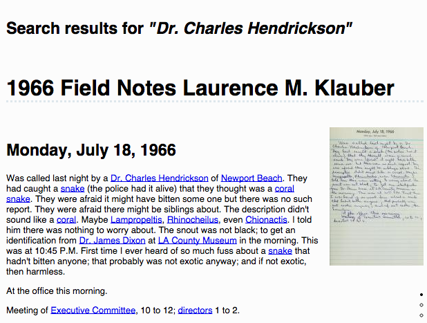
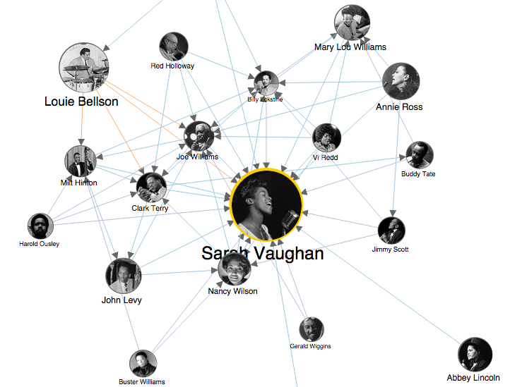

Many museums, archives and libraries are exploring Linked Open Data to make their online collections more meaningful to researchers and to the public at large. From the [Rijksmuseum](https://www.rijksmuseum.nl/en/explore-the-collection/) in the Netherlands to the [Cooper-Hewitt](https://collection.cooperhewitt.org/) in New York, our cultural heritage can be explored in digital form with links to help us dive deeper. These aren’t just spiffed up websites, these are living representations of the physical collections with hooks for developers to build new applications that link back and let us look, listen and learn in new ways.

What if we could use this emerging foundation to allow researchers to publish links from one institution to another, connecting a letter in one archive to an artifact in another museum? People have been talking about these ideas since [Vannevar Bush imagined the Memex](http://www.theatlantic.com/magazine/archive/1945/07/as-we-may-think/303881/) the 1940s. Making it actually work requires a lot of disparate pieces: standard protocols, ontologies, digital representations of the physical works, and an audience with the digital tools for easy access.

I’ve been investigating a very small part of this challenge: connecting people through their things. Through interviewing researchers, archivists and museum collections managers, I’ve learned about traditional research techniques that suggest how an online system could work. Instead of linking as a post-process, the act of linking data could be part of the experience of researching and exploring online collections.

A Social Network of Dead People?
--------------------------------

What if we could pull all of this information together across collections in different organizations and present it in a unified way? Last year, working as a Presidential Innovation Fellow at the Smithsonian, I imagined what this might look like (illustrated above): a social network of historical figures linking archival documents to give us insights about history.

I quickly discovered the SNAC project ([Social Networks and Archival Context](http://socialarchive.iath.virginia.edu/)) which started investigating this idea several years before me. SNAC takes structured data from [EAC-CPF](http://eac.staatsbibliothek-berlin.de/) files, and connects people through annotations made by archivists all over the world who contribute their data to the project.

This published biographical data with links back to the source archives provides a valuable resource for researchers. SNAC name matching used automated techniques, leaving “maybeSameAs” connections where there is uncertainty:

> While refining the computational techniques used continues, such techniques alone will always fall short. The most fundamental problem is identifying when similar names are for the same person or different persons. Even for human editors, identity resolution can be an exceptional challenge and sometimes cannot be reliably achieved due to insufficient or ambiguous evidence. — [SNAC Research Use Notes](http://socialarchive.iath.virginia.edu/research_use.html)

Identity Often Requires Research
--------------------------------

[While there may be many people named Russell Hatch, ](http://americanhistory.si.edu/collections/search/object/nmah_1358110)[these boots](http://americanhistory.si.edu/collections/search/object/nmah_1358110) only belonged to one of them.

Mrs. Sydney Blake travels to South America on a scientific expedition, but her colleague’s field notebook talks only about Doris. [Archival research reveals](http://si-siris.blogspot.com/2013/09/field-notebook-mystery-triggers.html) that Doris Holmes Blake, wife of Sydney, was the travel companion.

Establishing an identity, based on a name is often an act of scholarship. Researchers explore the written record, piecing together history from different pieces of paper, photographs, or physical objects in museums

Even with clear records, facts can be disputed. There are errors in the archives that do not besmirch the disciplined care of the archivists. A birth certificate may show one date and a newspaper article a different one. One historian may assume the birth certificate is correct, until another finds a diary entry telling the funny story of a town hall clerk who got the date wrong. One researcher told me of his challenges recording biographical data from Canadian Civil War soldiers because some thought it funny to write Feb. 29th as their birthday. We know an individual was actually born at a specific date and time, but once that time is in the past, facts can become subjective.

People have always researched history by looking at the artifacts left behind. Even today, researchers travel from archive to library, often across the world, to piece together stories from letters, diaries and even notes in guestbooks at historic homes. They build a picture of what a life was like from prized possessions or everyday objects now housed in museums, from news sources, and from the stories written by friends and colleagues, both positive and slanderous.

Thousands of researchers create these kinds of links every day. They are footnotes in scholarly articles, books, and research papers. They are the tabs open in a grad students’ browser. Interviews with researcher suggest that if we could allow them to leave a trail, they would contribute to the world-wide store of knowledge.

A New Model of Publishing
-------------------------

We’re starting to see new patterns emerge online with new interfaces that allow people to take part in linking historical artifacts. Volunteers transcribing field notebooks link scientists, subjects and specimens using [wiki-like markup at FromThePage](http://fromthepage.balboaparkonline.org/display/search?article_id=7780). Jazz enthusiasts can read transcripts of conversations with musicians at [LinkedJazz 52ndStreet](http://linkedjazz.org/52ndStreet/) to build a [social network](http://linkedjazz.org/network/) that with links back to the oral histories.

Emerging on the web, there’s a new model of publishing. Instead of links being created with markup and behind-the-scenes tools gated by a webmaster, connections can be added with simple text annotations or the touch of a button.

<figure class="wp-caption thumbnail alignleft" id="attachment_5316" style="width: 300px;"> <figcaption class="wp-caption-text">At BalboaParkOnline volunteers transcribe documents and add links.</figcaption></figure><figure class="wp-caption thumbnail alignleft" id="attachment_5322" style="width: 300px;"> <figcaption class="wp-caption-text">Sarah Vaughan’s social graph at LinkedJazz created by volunteers annotating transcripts of oral histories.</figcaption></figure>