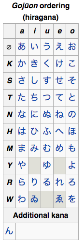

Today I learned about いろは (iroha) a different way to learn Hiragana than the [gojūon (五十音) ordering](http://en.wikipedia.org/wiki/Goj%C5%ABon) I learned in my Japanese class, where the characters are displayed in a grid. It makes sense to teach that way since it is easy to see which share same beginning (consonant) sound or ending (vowel) sound.

However, I knew the characters once and wanted to make my study session more interesting. I had forgotten about half the characters since first studying Japanese four years ago and wanted to review using actual words. If I could learn the characters with the context of real language then I could learn vocabulary at the same time. I wondered if there were a “quick brown fox” ([pangram](http://en.wikipedia.org/wiki/Pangram)) for Hiragana.

I quickly found [いろは](http://en.wikipedia.org/wiki/Iroha) (iroha) an ancient Japanese poem:

いろはにほへと  
ちりぬるを  
わかよたれそ  
つねならむ  
うゐのおくやま  
けふこえて  
あさきゆめみし  
ゑひもせす

This poem not just an arcane bit of trivia, but a real ABCs of Japanese, where the ordering from the poem is still used today. I found a wonderful video [What is “いろは iroha”?](https://www.youtube.com/watch?v=-kmtHTUUCvI) that tells the story of this word which means “basic” or “fundamental” in Japanese. I learned that the first 7 characters are used for musical notes (the way we use A-G, in Japanese they use いろはにほへと. I read elsewhere that theater seats are often ordered this way.

I realized that if I could learn this poem, I would also learn other useful aspects of the Japanese language and a glimpse of the culture as well. I wanted to hear it while I studied, and found answers via my new twitter friend Charelle Collett ([@Charcol1900](https://twitter.com/Charcol1900))

Here’s someone singing it in a child-like ABCs — no idea what the words on the right are, but this is the very clear to follow along and practice reading while hearing the characters pronounced:

http://youtu.be/NTkyIW6eX8E

and here’s Hatsune Miku (Vocal software) singing it:

<iframe allow="accelerometer; autoplay; clipboard-write; encrypted-media; gyroscope; picture-in-picture" allowfullscreen="" frameborder="0" height="433" loading="lazy" src="https://www.youtube.com/embed/oESk9EUP4VA?feature=oembed" title="いろは歌（伊呂波歌）" width="770"></iframe>

This second one is really interesting since it also shows the evolution of early Japanese script into modern Hiragana and then shows some more variants — here’s some detail on the first three.

1. [Man’yōgana](http://en.wikipedia.org/wiki/Man%27y%C5%8Dgana): an ancient writing system that employs Chinese characters to represent the Japanese language
2. [Chinese Cursive Script](http://en.wikipedia.org/wiki/Hiragana#History) from which Hiragana evolved
3. Modern Hiragana