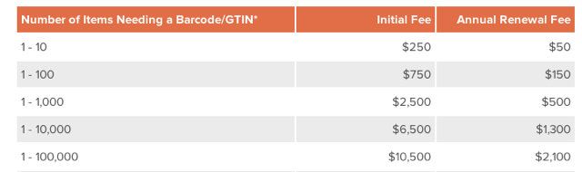

Signing up for Amazon fulfillment for our new [Mightyverse card game](http://www.amazon.com/%C2%A1D%C3%ADgame-Spanish-Learning-Card-Game/dp/B00QRX0ZFO), I found that I needed a Universal Product Code (UPC) or European Article Number (EAN). Amazon referred me to [GS1US](http://www.gs1us.org/) which sells 1-10 bar codes for $250, with an annual renewal fee of $50. Wow. That’s an expensive number, and a hefty fee for them to maintain a row in a database table for me.

A quick google search later, I found dozens of companies offering cheap barcodes for UPC and EAN numbers. A $5 one-time fee for someone to generate a number for me seemed much more reasonable. However, it turns out that many of these are scams — selling invalid codes or ones they don’t own or don’t have license to re-sell.

> … if a company joined the Uniform Code Council (now GS1-US) prior to August 28, 2002, the Uniform Code Council’s membership and licence agreement did not contain any prohibition against subdividing the numbers… This appears to have been a side consequence of the class action settlement. The product numbers from these companies are legitimate, however they will only be valid for as long as the companies are in business.  
> — [BarCode1 FAQ](http://www.adams1.com/faq.html)

[George Laurer](http://www.laurerupc.com/), who developed the Universal Product Code in 1973, maintains a [UPC Blacklsit](http://www.laurerupc.com/) and recommends this [UPC registered sellers list](http://authenticatedupcregistrationdirectory.org/node/48). Despite being on that list, I’m avoiding InstantUPC since they have an [FTC complaint](http://www.ftc.gov/system/files/documents/cases/140721instantupccmpt.pdf) against them.

After looking at a few sites I picked [Legal Barcodes](http://www.legalbarcode.com/) which sent me an email with UPC numbers. It turns out Amazon does everything in EANs these days, but magically transformed my UPC into an EAN by adding a zero to the beginning of it.

I hope this helps someone else!