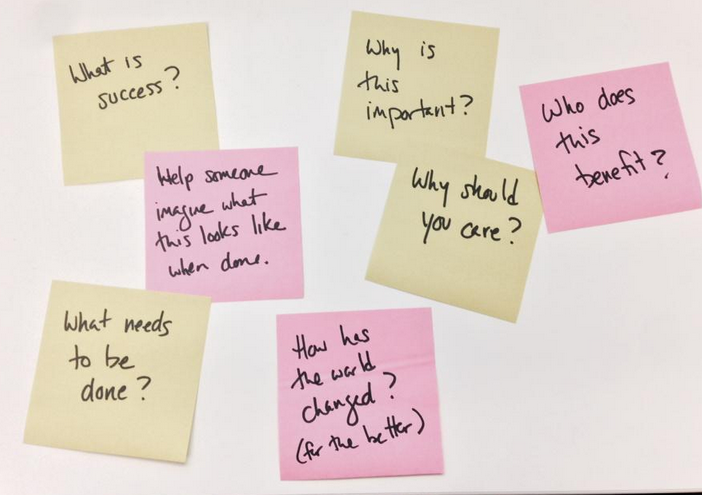

I had a great design session last week with [Chacha Sikes](https://twitter.com/chachasikes) who volunteered to help with [Midas](https://github.com/18F/midas), an open source project that I’m working on for the US Government. I love open source development — with an influx of new colleagues at unexpected times, I’m always learning new things.

We decided to focus on the challenge of designing the [new opportunity workflow](https://github.com/18F/midas/issues/318) — this was identified as a significant usability issue at our last [open source hack night](https://18f.gsa.gov/2014/12/10/great-community-turnout-for-open-source-hack-night/) and we’ve also heard consistent feedback from people who are actively using the product that this key part of the experience needs improvement.

We started with the most basic, simple, yet challenging questions:  

- What is success?
- Help someone imagine what this looks like when done.
- What needs to be done?
- Why is this important?
- Why should you care?
- How has the world changed? (for the better)
- Who does this benefit?

These were questions that we specifically brainstormed around the definition of an “opportunity” or a task in this micro-tasking framework. What questions do task creators need to answer in order to motivate potential collaborators?

It struck me on reflection that these are the same questions we should ask ourselves when designing software. Too often we focus so much on building the software, that we miss what happens after someone is done. I like to think about how these tools positively affect someone’s life later, outside of the software, when they have successfully accomplished whatever it is we helped them make happen.