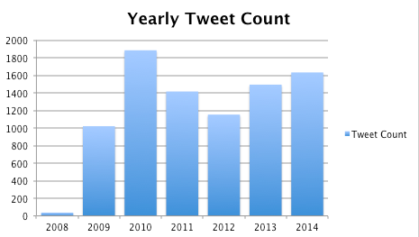
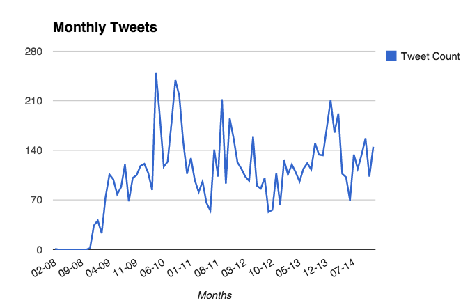

A data-driven reflection on my twitter years… It doesn’t seem like pure quantity tells much of a story for me. Maybe it does for you? In your twitter settings you can request an archive and run the little ruby scripts below.





Ruby script to calculate how many tweets per year

```

require 'csv'
require 'time'
text = File.read('./archive/tweets.csv')
csv = CSV.parse(text, :headers => true)

result = {}
csv.each do |row|
    year = Time.parse(row['timestamp']).year
  result[year] ||= 0
  result[year] += 1
  end

result.each do |year, total|
  puts "#{year}\t#{total}"
end
```

Tweets per month with the lovely strftime function:

```

result = {}
csv.each do |row|
  time = Time.parse(row['timestamp'])
  month = time.strftime("%m-%y")
  result[month] ||= 0
  result[month] += 1
  end

puts result.inspect
result.each do |date, total|
  puts "#{date}\t#{total}"
end
```