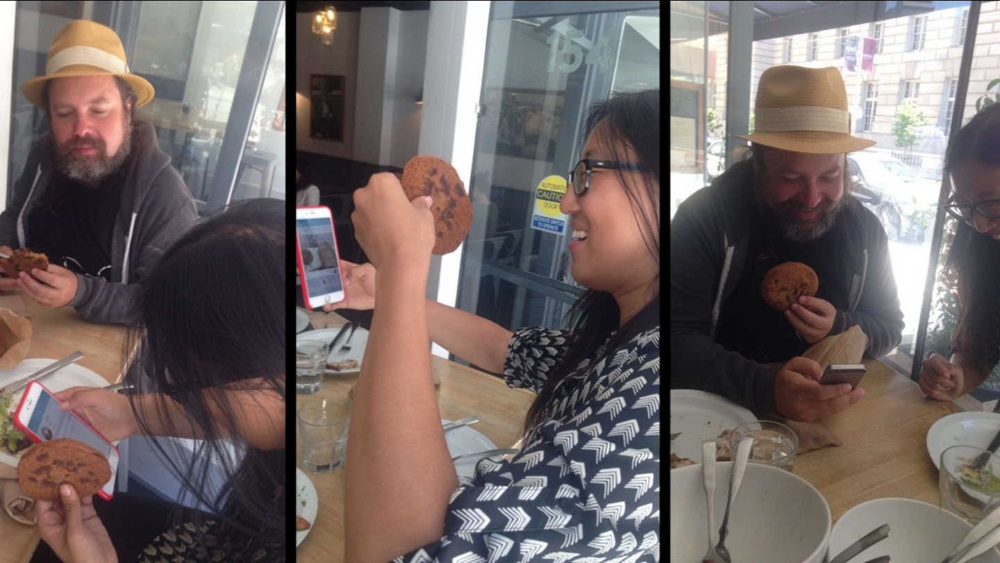
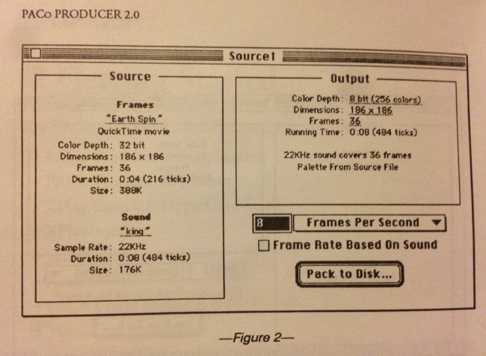

Making your app fun to use requires more than sprinkling a little gamification on top. It requires thoughtful imagination and experimentation. I recently spoke at [AltConf](http://altconf.com/schedule/): “Designing for Fun” (now on [video](https://realm.io/news/altconf-sarah-allen-designing-for-fun/)) highlights some expert perspectives on theories of play and behavioral psychology, and how we can apply these ideas in mobile app design. I also shared some prototyping and customer development techniques, plus how to validate whether a design will actually be fun.

Below is an overview, plus notes and references from the talk. You can also check out the [slides](http://www.slideshare.net/sarah.allen/designing-for-fun).

Most of this talk is about how to design fun experiences, but the title has a double meaning — I talk about an app I’m working on “for fun” (not for “work”). Most of the code was written by my friend and iOS development mentor, [John Fox](https://twitter.com/djembe), plus we have a large extended team of people who make it happen. The thing about doing an app outside of your day job means that we work hard to make sure we’re all aligned and are motivated and having fun, since when it stops being fun, we’ll stop playing.

For the first half of this talk, I focus on theories of play and game design, with a couple of examples from my prior work. The second half shows a practical use case from the Mightyverse app we are building now.

For context: [Mightyverse](https://www.mightyverse.com/) is a global community of people sharing language and culture. At it’s heart, there’s a collection of short phrase videos of people who have recorded a phrase in their native language, that is cross-translated into other languages. We have collected tens of thousands of short phrase videos for learning language and we’re building a mobile app to crowdsource recordings from native speakers, while also allowing people to learn new languages.

Notes and References
--------------------

Sebastian Deterding: Meaning, Autonomy &amp; Mastery. From Google Tech Talk, [Getting Gamification Right](https://www.youtube.com/watch?v=7ZGCPap7GkY)

Research has identified the chemical dopamine affects learning and memory. Doing something rewarding increases dopamine. Eric Marr at TEDxCCS: [Dopamine’s effects on learning and memory](https://www.youtube.com/watch?v=n706_qp20Mk)

The *EPIC Win*is an extraordinary outcome that you didn’t believe was even possible until you achieved it — almost beyond your threshold of imagination, something that teaches you what you’re truly capable of. “Gamers always believe that an epic win is possible, and that it’s always worth trying, and trying now.” Jane McGonigal TED talk: [Gaming can make a better world](http://www.ted.com/talks/jane_mcgonigal_gaming_can_make_a_better_world?language=en)

Almost 50% of the world’s languages are at risk. In my talk I said “the people who decide which languages we keep are three years old.” The source for this was linguist David Harrison’s talk [Living Languages Digital Dialog](https://dotsub.com/view/d88e920e-9d6b-4862-a712-7259003bd00a). He actually refers to 5, 6, and 7-year olds, who he calls the “true decision makers in communities about whether to keep or abandon a language.” When we as adults show we value a language, the kids learn it.

There are over 6000 languages in the world — this [WSJ article](http://blogs.wsj.com/numbers/how-many-languages-are-endangered-195/) is a good reference. The majority of them are spoken by a tiny fraction of the population, and almost 80% of us, speak only 83 languages — I created the visualization for a 2009 blog post: [who cares if languages become extinct?](https://www.ultrasaurus.com/2009/02/who-cares-if-languages-become-extinct/)

Play needs to be voluntary for it to be fun. I can’t find the reference for this, despite looking many times. Maybe it was in one of these videos or some article I read. If anyone has this reference I would love to read it again!

Frank Smith, a leading authority on linguistics and cognitive psychology, reports that: “Learning is the brain’s primary function, its constant concern, and we become restless and frustrated if there is no learning to be done. We are all capable of huge and unsuspected learning accomplishments without effort.” ([Insult to Intelligence: The Bureaucratic Invasion of Our Classrooms](http://www.amazon.com/Insult-Intelligence-Bureaucratic-Invasion-Classrooms/dp/043508478X)).

“Fun is just another word for learning under optimal conditions.” — [Raph Koster](http://www.raphkoster.com/)

I believe that software design is teaching. We want to make it so people can effortlessly learn how to use a piece of software. Every little bit of learning should give people powers they can use repeatedly toward achieving their own goals.

This is the first dialog box I ever designed was for PACo Producer. I scanned this from the documentation:  
  
The little dotted link is a pre-web hyperlink. Easy to learn and remember since it is related visually to a real-world paper form. It is worth teaching someone something to give them a powerful new tool. It seems like this was successful since we used the same pattern in After Effects, and it has persisted over 20 years later, likely having survived many usability tests.

I wondered… After Effects has a lot of complex UI, which is pretty overwhelming at first glance. I asked a colleague of mine who has been a user of After Effects since 1.0: is it fun to use?

“I love it. Anything is possible when i use it…I can dream up something and then make it real.  
It keeps improving and with each improvement i’m able to communicate my ideas a little faster, a little more clearly…” — Paul Lundahl

After Effect screen shot was composite from: https://florianvo.wordpress.com/

I shared an example from the development of Flash video, circa 2001. The overwhelming assumption at that time for mutliplayer games or web video conferencing was that the experience would start with a login screen. It was Jonathan Gay who really challenged that assumption by insisting that we make it so Flash applications could enable real-time human-to-human interactions without requiring a name or password.

People already know how to interact with each other. Don’t make people make decisions until they have to, or you risk that they will make the decision to leave your app!

### What are these optimal conditions for learning?

Stress actually inhibits learning. The optimal state of mind for learning is “relaxed alertness” Geoffrey Caine &amp; Renate N. Caine [Making Connections: Teaching and the Human Brain](http://www.amazon.com/Making-Connections-Teaching-Human-Brain/dp/0201490889/)

In early 1900s, Lev Vygotsky studied imaginative play in children and observed that children will subordinate their own wants to the greater pleasure of following the rules. “The essential attribute of play is a rule that has become a desire.” (Vygotsky, [Mind in Society](http://www.amazon.com/Mind-Society-Development-Psychological-Processes/dp/0674576292))

Stephanie Morgan Creative Mornings talk “[Gamification Sucks](http://creativemornings.com/talks/stephanie-morgan/1)” Computer games stimulate the brain’s reward system to produce dopamine — in addition to making us feel good, this chemical seems to be the physical basis for learning. Research has shown that the introduction of chance into any reward system increases dopamine production.

### Play Testing

All of us are not in the target audience for our app. We need to be careful about interpreting our own responses to our inventions, but often we have some characteristics of our own target audience and can be the very first play testers. In our Mightyverse team, Iku is always seeking to improve her english, and Paul and I have taken some Japanese classes, so we figured we were good for a first test. Our goal to is get people to have fun actually speaking the language they are learning. We intentionally designed without a point system, since we believe that language learning can be intrinsically fun. We tested this theory by making a game without an external point system, just tracking whether the players learned the phrases together.

> “Shut up and sit in the corner and watch.  
> See if people who play your game are having fun  
> and playing the way you expect,  
> and are able to learn the rules easily.”  
> — [Cooperation and Engagement: What can board games teach us?](https://www.youtube.com/watch?v=cdTVcFo2EQw) Google Tech Talk by Matt Leacock

Be careful who you pick to play test your game — not just your brother, your wife or husband, your kid, unless they are in your target audience.

The first Mightyverse game play test with real audience was at [SF Babel](http://www.meetup.com/SFBabel/): 3 decks, written on index cards with 200 phrases in English, Spanish and Japanese.

Games are more fun when people are expecting to play a game. The game state, with its suspension of disbelief, and the rules create this alternate reality within which you can have fun. Games are more often played in the living room or around a kitchen table. Play test with your friends. You want your first play tests to be with people who will still play your game again, even if the first experience is frustrating or boring. Your friends will always play a game with you. Of course, they need to be part of your target audience. If you don’t have any friends who are part of your target audience, go out and meet people in your target audience and make friends with them.

Another great way to find people in your target audience is a crowd-funding campaign. If people will pay for something that doesn’t yet exist, then they probably want it. We knew we needed to do a lot more play testing, so we decided to commit to printing the game in order to find more people in our target audience with the campaign, setting us firmly on the path of learning about our future customers and validating our theories about how to make language learning fun. We made [this video](https://www.youtube.com/watch?v=ZIrp8xQscJI) during the campaign — it’s not just marketing, it’s learning about what resonates with people.

Shigeru Miyamoto, famed Nintendo game designer who created Super Mario and the Wii, is known for designing for the expression on someone’s face when they play the game — they should smile and be happy, not frustrated. With the Wii, he designs for everyone in the room, not just the game player.

Our goal is to get people to have fun learning the language. The card game succeeds in that at a small scale. Now that we have developed our own model of language learning and have evidence that it is fun, we can scale our efforts by designing a mobile app — in many ways it will be completely different, but we can apply those core principles that we have validates.

We first built a very small app that only did phrase recordings, and we created a collaborative activity where people would record different phrases of the [Martin Luther King “I have a dream” speech translated into Spanish](https://www.mightyverse.com/en/phrase_lists/martin-luther-king-i-have-a-dream-in-spanish). We wanted to learn if we could construct and activity and get both friends and strangers to engage with our app. We found people that actually seemed to have fun recording phrases. We noticed that some people got their friends involved, and we designed around the parts of the experience that seemed most fun and engaging.

It can be emotionally difficult to test your app when it’s not finished, but that is exactly when you need to test it. It is SO important to start engaging people in the experience. One way to look at it is that the play-test itself is a game.

Here are the rules that I use to make it fun:

- Shut up and Watch
- Take Notes
- Take Photos
- Resist providing answers.
- Ask questions.

Questions I ask:

- What do you think this app is for?
- What did you expect to happen?
- Did you have fun? What part of it was fun?
- Did you learn anything?

[Designing for Fun Slides](http://www.slideshare.net/sarah.allen/designing-for-fun)

Photo Credits:  
RyanMcGuire, [Cats Jumping Playfully](http://pixabay.com/en/cats-jump-play-playful-feline-558077/)  
Tambako The Jaguar, [Playing Cubs](https://www.flickr.com/photos/tambako/6453295167/)  
Tambako The Jaguar, [Playing with mom II](https://www.flickr.com/photos/tambako/6831507351/)  
Juhan Sonin Follow, [Udo finds Viggo](https://www.flickr.com/photos/juhansonin/8600732599)  
Steven Depolo, [Children Twister Party](https://www.flickr.com/photos/stevendepolo/6054960008/)