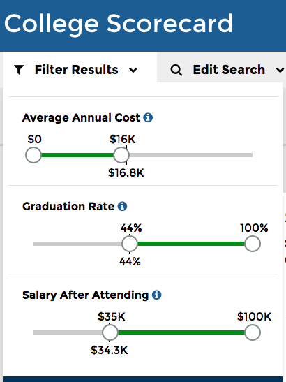
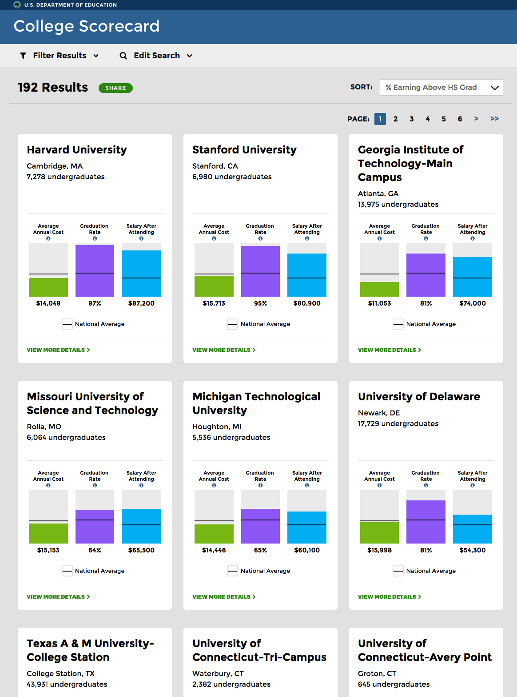

The Dept of Education just released its new [College Scorecard](https://collegescorecard.ed.gov/), which includes never-before-released data like earnings 6-10 years after leaving school, combined with previously open data like admissions and completion rates. The data reveals data about the school, not individual student data, with the goal of helping prospective students compare schools based on real data about outcomes.

It was announced yesterday in [President Obama’s weekly video address](https://www.whitehouse.gov/the-press-office/2015/09/12/weekly-address-new-college-scorecard) along with a wonderful behind-the-scenes look at the [human-centered design process](https://www.whitehouse.gov/blog/2015/09/12/under-hood-building-new-college-scorecard-students).

My primary role has been to make the data available in a way that made it possible to build such a lovely website and also for others to create their own tools and analysis. With the help of open source contributors and colleagues at 18F, I created the [Open Data Maker project](https://github.com/18F/open-data-maker) that powers the [College Scorecard API](https://collegescorecard.ed.gov/data/documentation/).

The really innovative work was done by the Department of Education, bringing together data from Treasury and IRS, combined with their previously open data from the [Office of Postsecondary Education](http://www2.ed.gov/about/offices/list/ope/index.html).

In working on this project, I learned that the average high school graduate earns $25,000 per year. One way to look at the the value of the education offered by a particular school is the percentage of students who later earn more than those without a college education. This was chosen as the default sort order (“% Earning Over HS Grad”).

The site allows some filtering on additional data points: cost, graduation rate, and salary after attending. Looking at 4-year liberal arts schools (by picking those that offer a History degree), that are below average cost, and higher than average graduation rate and salary after attending, I found these results:

I was surprised to see Harvard and Stanford at below average cost — it is great to see these schools putting their large endowments to good use. Looking at details for Harvard, for example, we can see that costs vary widely based on family income and there’s a link with a link to the “net price calculator” which is provided by every school:

Unsurprisingly, technical schools are high on a list sorted by earnings, though liberal arts school are also prominent. For example, the University of Delaware shows great outcomes for students at below average costs:

