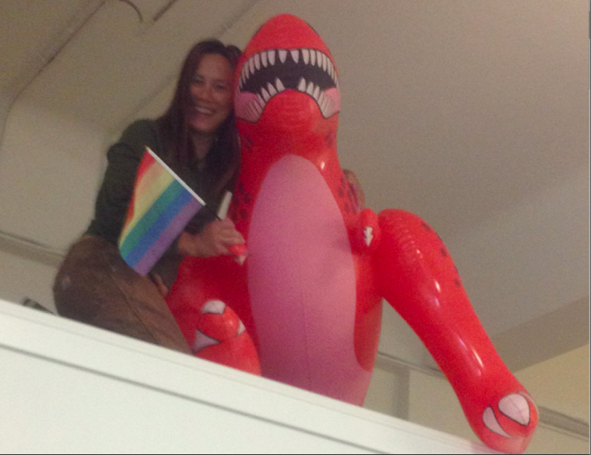

One of my best decisions as CEO of Blazing Cloud was to set a policy that any employee was authorized to spend up to $25 on the purchase of something they needed for their work.

This was intended for things like office supplies and notebooks. Also people were encouraged to buy things for the whele office, not just for themselves when they saw a need. This meant that it wasn’t just the office manager’s job to make sure we had whatever anyone decided they needed. We were a small team and people would look out for each other.

I think someone may have actually asked me about the purchase of a giant inflatable dinosaur, but it was a pretty independent action from the team from my perspective. I arrived back from a ski trip to a new member of the Blazing Cloud family. She was named Tyra, and she would hang out near the entrance or above a conference room. She celebrated Pride with us with her own little rainbow flag and even earned a mention in an [NPR story](http://www.npr.org/templates/transcript/transcript.php?storyId=178810467).

She was a part of the Blazing Cloud culture. I used to say that “Blazing Cloud was optimized for fun.” I was often unsuccessful in achieving that goal, but I’m proud of a few things I did that I think helped foster a spirit of joy and delight amongst the creative and talented people who joined me in making that small company happen.

Culture is What You Do
----------------------

Most people don’t like making rules, but rules can be liberating. It was liberating to have a corporate policy about how money is spent and what does not need approval, followed by examples of people collaborating on shared purchases and individuals buying a favorite (expensive) notebook or pen. I believe that craftspeople need to have the best tools. I don’t need to mediate what kind of pen someone uses, and having them feel a sense of pleasure in their work as their pen slides across paper is priceless.

I don’t have any research to back it up, but I believe that there is a [psychology of abundance](https://www.ultrasaurus.com/2009/08/psychology-of-abundance/) — this feeling of abundance sparks creativity. I believe that large monitors make us smarter. We need space to think and an endless supply of post-it notes. We need to be surrounded by smart people who value difference — different ideas, different customs, different skills. I don’t care who you are at home, if you show up and are kind to your co-workers, yet don’t back down from speaking truth when you disagree. There’s a whole set of values that I hold and a belief system about what makes a great team, and the seemingly little decisions create an environment to make that happen.

All of the Blazing Cloud culture might not be directly related to that giant inflatable dinosaur, but having rules and precedent that favor independent action and individual choice can foster creative inspiration.

