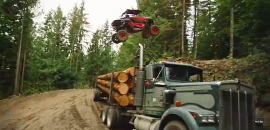

An epic win is an extraordinary outcome that feels impossible, until it happens. What does it take to imagine that epic win? What needs to happen so that we can believe that it is possible, and in creating that belief, we create the space for it to actually happen.

Many steps are hard, and many have significant risk of failure. It is so unlikely that enough things would go right that you will achieve that goal. You try things and sometimes you fail, and sometimes you win, and every win moves you closer to that goal.

When we believe something is possible and desirable, yet uncertain, we want it more. It explains why we like gambling, and (mostly) don’t like to work even though we know we’ll get paid for it. There’s quite a bit of fascinating research that dives into the details. I recently read a really nice explanation:

> …making the unknown known — i.e., figuring out what is in a wrapped package or finding out which reward one has earned — is a positive experience. Because people are excited to find out what they can actually get, working for an uncertain reward makes the whole situation more like a game and less like work.

— [ChicagoBooth](http://www.chicagobooth.edu/about/newsroom/press-releases/2014/2014-10-13-1) report on [The Motivating-Uncertainty Effect](http://faculty.chicagobooth.edu/ayelet.fishbach/research/Uncertainty_JCR.pdf)

It is the uncertainty which makes the epic win so appealing. Persisting through that experience of uncertainty seems to be its own reward. Our human brains release dopamine at these moments — this chemical does not only bring us lovely happy feelings, it’s also correlated with increasing our ability to learn. Of course, we have to win around half of the time, on average, for it to continue to be fun.

In retrospect, we can see a complex feat that has been reduced to a thousand micro-skills, where a human being has learned those skills and applied them in such a focused way that the impossible has not only become possible, it is has become certain.

Witnessing an epic win expands our ideas about our own limits. We can see that another human did this thing that we never imagined was possible.

There is a joy in mastery. We reach a certain level of skill where we can be incredibly good, yet in practicing that skill we become better. Interesting to look at the definition of epic win, as evidenced by [epic win video compilations](http://www.tubechop.com/watch/6997174) (there are over 50 of these on YouTube) and [parkour](https://www.youtube.com/watch?v=NX7QNWEGcNI), Almost all of the videos show solo wins — incredible acts by individuals. I believe the more epic wins are those where we work with other humans to do more than we each could make possible, whether it be an organized team where you know all of the people, or a crowd aligned to a purpose mediated by software or seemingly unconnected individuals who find themselves part of a [kurass](http://www.youhavetolearncomputers.com/blog/2015/9/23/saying-goodbye-to-jake-brewer).