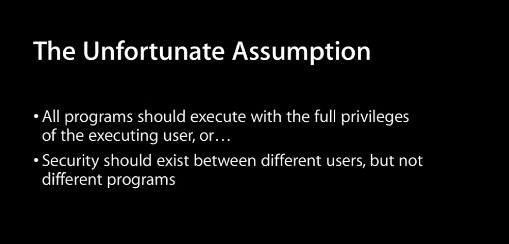
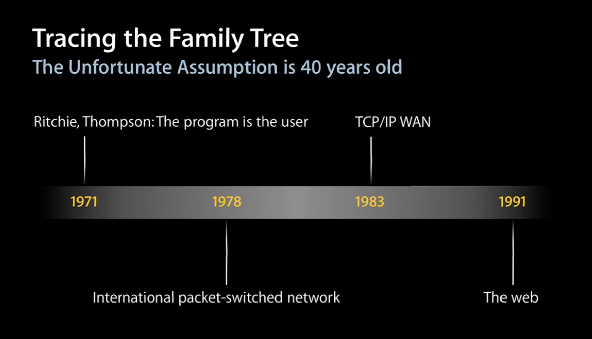
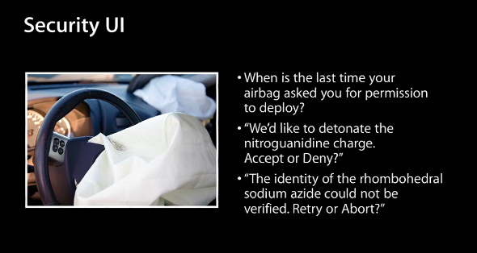

Ivan Krstić provided a computer security primer with some interesting historical context when he introduced the Mac App Sandbox in 2011. I learned these important concepts when I started writing web software in 1995 with the Shockwave player, but I’ve never seen as clear an overview as in the [first 20 minutes of this talk](https://developer.apple.com/videos/play/wwdc2011-203/).

Here are some highlights:

We are conditioning our users to ignore our security messages…

What if we took this approach with car airbags?

The root problem is one of “ambient privilege.” Just because of the person who happened to run a program, we give that program all of the privileges we would give to the person. However, no human can understand and review all of the lines of code that we execute every day.

We are building complex systems, which *always* have vulnerabilities.

Complexity is growing, and there is no limit on the kind of damage an exploit can do. From cars to fighter planes, the amount of code we are putting into our vehicles has increased dramatically over time.

100M lines of code in a car today….

Mostly, the Mac App Sandbox introduces ideas that the Web Browser introduced in 1993, Shockwave in 1995 with a full program language, then with JavaScript running in its own sandbox a couple of years later. There are some new ideas, of course. One that I particularly like is the notion of leveraging the File Open dialog to capture a user’s intent and seamless allow selective file access only to those files that the user chooses to open.

We need more creative and thoughtful user experience design that allows humans to safely interact with a complex world.