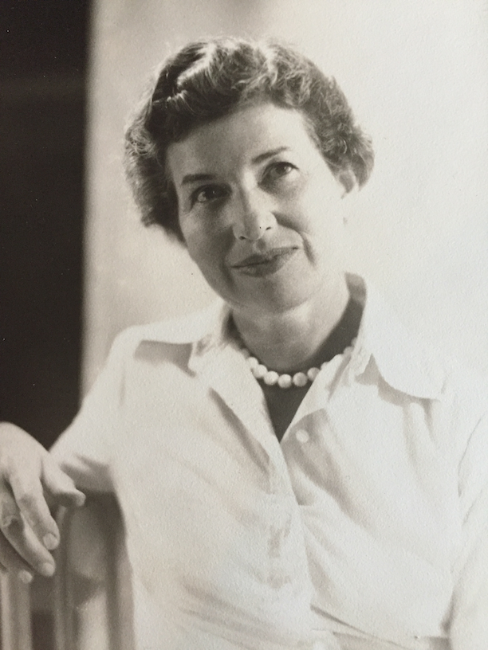
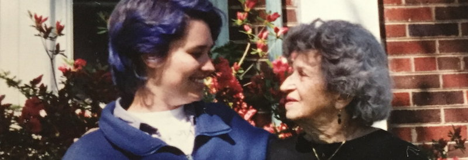

I was the only grand-daughter of Frances Clara Kiefer Bragg who passed away on March 11 just 15 days before her 108th birthday. She was a loving, yet formidable force in the world. As a child, we would often visit her in her home in Cambridge when we lived near Boston and when we lived in other countries, she would visit us for a few weeks or months. Small lessons were embedded in our interactions, and there was always a proper way to do things. We needed to know how to conduct ourselves in society: when you set the table, the knife points toward the plate, always hang paintings at eye-level. There was a *right* way to make borscht and chicken soup. I learned sewing, cooking, and appreciation of fine art from my grandmother. She told funny stories of her travels, and family history, sprinkled with anecdotes of poets, writers and presidents.

As a teenager, I rebelled and stopped doing all of the things I was told to do. I figured maybe one didn’t *always* need to write a thank you letter – sometimes a phone call would be even better. And also, as a teenager sometimes I just didn’t feel like doing what was right and proper.

Now, reflecting on those early lessons learned from my grandmother, I wonder if the impression stuck with me that whatever my grandmother did was the appropriate and proper thing to do in society. I followed her lead in other ways. It felt appropriate and proper for a young woman to travel alone in Europe, and that one must speak one’s mind, as long as it is done politely.

Somehow it all seemed normal that my Grandma visited my cousin in India and rode on the back of his scooter. I couldn’t find that photo, but I found this one, I think from that same trip…

Fran spoke French, German and Russian quite fluently at times, along with quite a bit of Spanish and Italian, and random phrases in half a dozen other languages. She lived in the real world of typewriters and tea. She could remember when the ice-box was kept cold with real blocks of ice. She told stories of when her family got a telephone, and when her father proudly drove their first car.

In the 90s, I tried to get her connected to the internet, telling her that she could send email in an instant for $20 per month. She asked, “why would I want to do that, when sending a letter costs just 32 cents? I don’t send *that* many letters every month.”

While we lived on this earth in some of the same decades, during these years of my adult life, we inhabited quite different worlds. From my world of software and silicon, I recall that people used to say of Steve Jobs that he created a *reality distortion field*, where people would believe his vision of the future — a future which would otherwise be unrealistic, yet by believing in it, they helped him create it.

I believe Fran had that power to create her own reality distortion field where people are witty, and heroes emerge from mundane events. Memories are versed in rhyme, silliness is interwoven in adult conversation, and children are ambassadors of wisdom. Memories of my grandmother are splashed in vivid watercolor or whimsical strokes of ink. Postcards can share a moment. Words have layers of meaning, which evaporate upon inspection.

