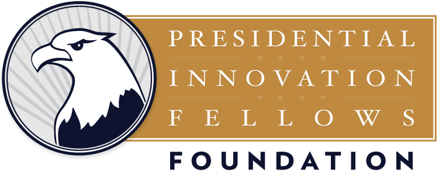

There is a tremendous sea of good will in the public to volunteer their time, energy, and services to support Veterans and their families. The Department of Veterans Innovators Network has a lengthy list of potential innovation opportunities to serve Veterans, ranging from developing reimagined service journeys for Veterans seeking mental health services to designing 3D printed personalized assistive technologies for Veterans with disabilities to developing a machine learning algorithm to scan retinal images to detect blindness in Veterans.

The question becomes: how to match the talents and spirit to serve of citizens of the United States with the opportunities and needs of employees within the Department of Veteran Affairs?

Our goal is to harness the ingenuity and brainpower of the public and pair this talent with projects in need across the Department of Veterans Affairs (VA). On the platform “Serving Those Who Served Us”, the public will be able to come for an “innovation volunteer tour” and collaborate with VA employees, Veterans, and Veterans supporters on a portfolio of innovation-related projects across the Department. These are short term projects ranging from activities that could take a couple hours to a couple months and are in need of the brain power + talent of innovators, such as designers, engineers, developers, entrepreneurs, and data scientists! Most volunteer activities can happen virtually with volunteers and staff collaborating from different locations.

This is how it will work:

- VA employees will post innovation project opportunities on to the “Serving Those Who Served Us” platform. These projects will list out their problem statement, a short summary of the project, and the potential tasks for the project and skillsets needed.
- External innovators can create a profile and browse opportunities to volunteer.
- When the external innovator finds a project of interest, they can then contact the VA employee through the platform and they can begin conversations to work together!
- External innovators can earn “badges” and recognition for volunteering their efforts to serve our Nation’s Veterans and their families! Also volunteers who volunteer often (and earn the most badges!) or get nominated from their VA employee will earn a special award from VA leadership!

To help accomplish this goal, the VA is partnering with the [Open Opportunities team](https://github.com/openopps/openopps-platform) to develop this platform and working with a local high school to build this platform as part of a STEM student project. We are looking for a team of developer mentors to help provide guidance to this team of high school students in leveraging the open source code of the open opportunities platform to build this platform to serve Veterans!

Anyone interested in volunteering to mentor the kids? It could be completely remote, though if you are in DC, we could probably set up time for you to meet the students in person too. We’re kicking off the project on Monday, but the kids don’t start for two weeks. We’re looking for a few more Javascript developers to help. Feel free to [contact me directly](https://www.ultrasaurus.com/contact/) or [reply on our mailing list](https://groups.google.com/forum/#!topic/openopps-platform/yO1uVmfTTUQ).

The Open Opportunities project is supported by:

<figure style="width:300px;float:left;text-align:center">  
Presidential Innovation Fellows Foundation  
</figure>

<figure style="width:300px;float:left;text-align:center">  
Cloud9 IDE</figure>