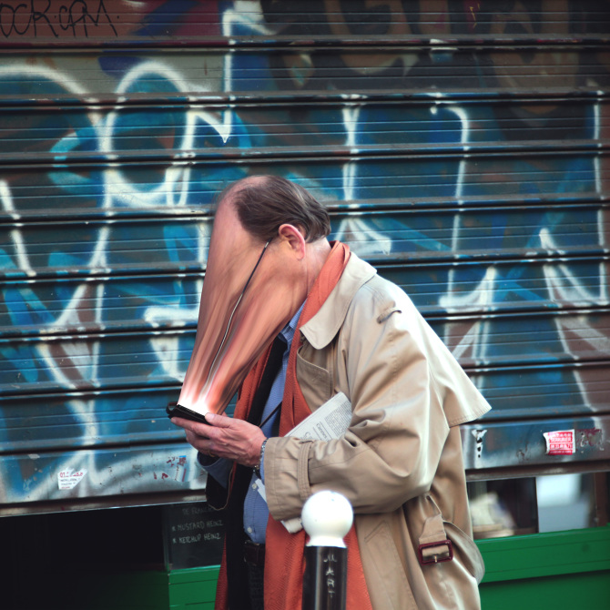

Antoine Geiger’s art and writing explore “the screen as an object of ‘mass subculture,’ alienating the relation to our own body, and more generally to the physical world… It appeases the consciousness, stimulates it, orders it, subjugates it.”

> Omniprésent: it’s everywhere. In your pocket, your car, your  
> appartment, your street.  
> Omnipotent : it is your best fellow, you give him all your friends, your good feelings and your holiday pictures.  
> Omniscient : actual swiss knife of the 21st century, without him we’re all lost.

> THE ESCAPE :  
> So we escape.  
> Even better, we project ourselves.  
> It’s like in cinemas, and yet it’s talking about you.  
> We press a button, screen turns on, and it’s like the whole physical world is frozen.  
> The show can start.  
> In the end we only escape from ourselves.

—Antoine Geiger

The [whole SUR-FAKE series](http://antoinegeiger.com/filter/art/SUR-FAKE) is delightful, strange and thought-provoking, and [accompanying essay](http://files.cargocollective.com/440813/SUR-FAKE--translated-.pdf) quoted above is just a page and worth reading. This visual artist creates unexpected imagery with words, describing this experience as a “curious ping-pong match with the pixels, terrified like a thick cloud of midges.”