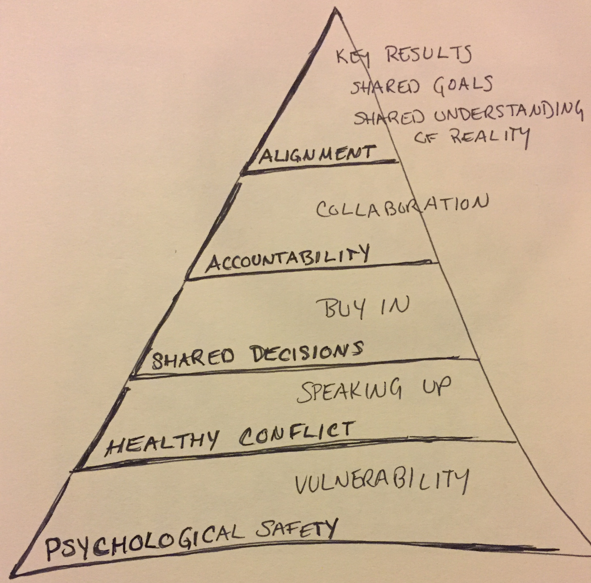

[The Five Dysfunctions of a Team](http://www.tablegroup.com/books/dysfunctions) by Patrick Lencioni tells the story of a fictional team leading a believable tech company. It illustrates how we bring our humanity and our flaws to work, even as good leaders who contribute exceptionally well, we can still fail if we can’t collaborate effectively on a shared goal.

The storytelling was particularly good at showing how it can be so hard to facilitate change. Everyone won’t be in the same place in the same moment. Someone gets it, while others are struggling. The best teams have a culture of helping each other, and we need to create that culture intentionally.

I tend to prefer non-fiction that conveys research when I read books about work, but decided to read it after it was recommended twice in one week (thx [Luna Comerford](https://twitter.com/lunacodegirl) and [Adria Richards](https://twitter.com/adriarichards)). I found this corporate fable to be compelling and thought-provoking. The audio book was particularly entertaining and was surprised to finish it in just a day mostly during dog walking, muni rides, and evening errands.

I enjoyed the book and agree with the five dysfunctions presented as a pyramid that illustrates how each weakness leads to the next. In thinking through my reflections on the book, I found it helpful to review [Abi Noda’s book notes](http://abinoda.com/book/five-dysfunctions-of-a-team). I liked his re-creation of the pyramid of dysfunctions, along with annotations, which inspired me to create my own alternate annotated pyramid:

At the top of the pyramid, the book talks about “inattention to results,” though the discussion is really about focusing on the right results, which are based on shared priorities and shared decisions. Individuals on the executive team might inadvertently jeopardize the company’s success because of their own status and ego. No one wants the company to fail because of their own functional area, and thus, well-meaning people can become defensive and fail to deliver on shared goals because they are too focused on their specific deliverable. Certainly we all need to deliver great results within our area of expertise, but that must be in support of a primary shared goal.

At the base of the pyramid is absence of trust. The book had an interesting anecdote on how “politics” is common on teams when people don’t trust each other. People use that word to describe different behaviors, but the CEOs definition works well in this setting: “Politics is when people choose their words and actions based on how they want others to react rather than based on what they really think.” When we work in an environment where we can just say what we think, trusting that people will believe we have good intentions and are working toward our shared goals, makes everything go faster and leads to better solutions.

I felt like I wanted to remember the functioning team and the positive state we’re striving for when we work well together. As the story progressed, I imagined the opposite pyramid. At its base is psychological safety, which allows people to be vulnerable; this creates an environment where people can speak up, allowing for and supporting healthy conflict. If people can have productive discussions and have respectful arguments, the team can make decisions that the each individual buys into. People hold each other accountable, but also support each other and collaborate, consistently seeking alignment on delivering on shared priorities. Working as a team requires repeated course corrections. We need to make time to help each other and if we’re all focused on different things, we just won’t have time to do it all. If we’re all focused on the same goal, supporting parts of the same deliverable, then collaboration helps each team member deliver on their individual work *and* the shared goal.

One key element to making good teams work well is what I call a shared understanding of reality. In the book, the new CEO starts each day of their executive offsite by saying: “We have more money, better technology, more talented and experienced executives, and yet we’re behind our competitors.” She was creating a shared understanding of reality. She was making it clear to the team that she believed in them and in the business opportunity. A lot of what we do when we create alignment on a team is to build that shared reality. Shared goals are built on shared information and shared conclusions, which are based on shared values.

There are lots of ways to think about how to create a healthy team. I like how Abi Noda reflects on the pyramid of dysfunctions presented in this book: “Teamwork deteriorates if even a single dysfunction is allowed to flourish, like a chain with just one link broken.”