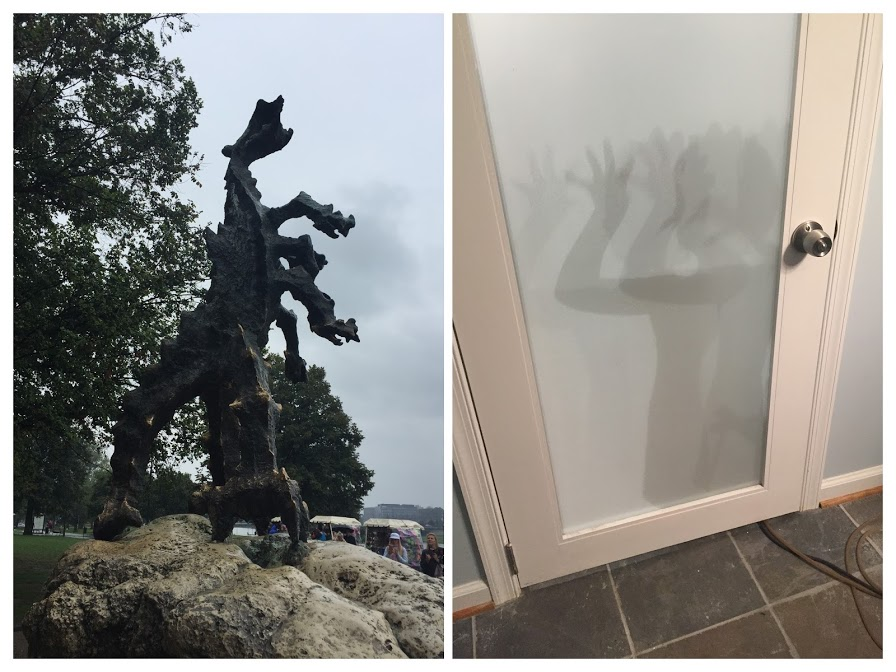

In my recent trip to Krakow, I bought a little blue stuffed dragon for my niece. I became curious about the legend of the [Krakow dragon](http://polandisawesome.blogspot.com/2012/07/the-legend-of-king-krak-and-dragon-of.html) and wanted to find a children’s story to listen to and maybe learn a little Polish and found a fun, modern interpretation: [Smok](https://www.youtube.com/watch?v=1J_Y12RqeLM).

