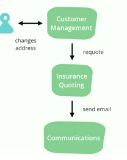
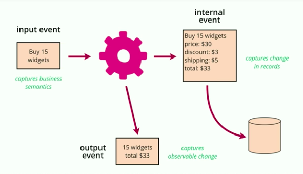
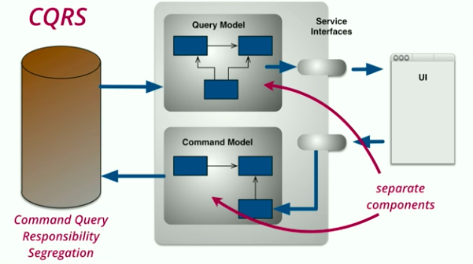

Martin Fowler’s talk “The Many Meanings of Event-Driven Architecture” at GOTO2017 provides a good overview of different patterns that all are described as “event-driven” systems. At the end of the talk, he references to an earlier [event-driven article](https://martinfowler.com/articles/201701-event-driven.html), which offers a good prose description of these different patterns that folks are calling event-driven programming. In this talk, he covers specific examples that illustrate the patterns, grounding them in specific applications.

<iframe allow="accelerometer; autoplay; clipboard-write; encrypted-media; gyroscope; picture-in-picture" allowfullscreen="" frameborder="0" height="433" loading="lazy" src="https://www.youtube.com/embed/STKCRSUsyP0?feature=oembed" title="GOTO 2017 • The Many Meanings of Event-Driven Architecture • Martin Fowler" width="770"></iframe>

Event Notification
------------------

For example: address changed

Scenario: CRM system stores information about people. An insurance quoting system generates insurance rates based on demographics and address. When someone’s address changes, we need to calculate a new value for the cost of insurance.

We often don’t want these systems to be coupled, instead we want a reversal of dependencies. This patterns is used in relatively large scale systems, and also a long-established client-side pattern to separate GUIs and the rest of your code.

The change becomes a first class notion. We bundle the notification + data about the change.

Events OR Commands  
\* Commands enforce the coupling, it’s very different from an event, it conveys intent  
\* Naming makes all the diffrence

Additional property → easy to add systems without modifying the original system

Martin notes “the dark side of event notification” where your system quickly becomes hard to reason about because there is not statement of overall behavior.

Event-Carried State Transfer
----------------------------

Named in contrast to REST (Representational State Transfer), the event carries ALL of the data needed about the event, which completely de-couples the target system from the system that originates the event.

Of course, this introduces data replication and eventual consistency (which can be good for some use cases); however, this is a less common pattern since this lack of consistency can actually make the system more complex.

Event Sourcing
--------------

This is one of my favorite patterns which Martin explains nicely in the talk with two examples:

- Version control is an event source system for code.
- Accounting ledgers track every credit or debit, which are the source records (events), and the balance is calculated from those records.

Benefits

- auditing: natural part of the system
- debugging: easy to replay a subset of events locally
- historic state: time travel!
- alternative state: branching, correcting errors
- memory image: application state can be volatile (since persistence is achieved with event log, processing can happen quickly in memory based on recent events that can quickly regenerate state based on recent snapshots)

Drawbacks

- unfamiliar
- external systems: everything needs to be an event
- event schema: what happens when your data types change?
- identifiers: how to create identifiers to reliably replay events

Common (Related) Challenges

- \*\*asynchronous processing\*\* can be hard to reason about. This isn’t required for an event sourcing system, yet it is easy to add and needed in most server-side systems. Useful to remember that this is distinct from the core event sourcing pattern.
- \*\*versioning\*\* is another option that is quite useful, yet also adds complexity. Greg Young’s advice: don’t have any business logic between the event and the internal representation of a record.

Martin talks about the difference between input event (the intention) and the output event (the effect). In deciding what to store think about how we would fix a bug. The key thing is to be clear about what you are storing, and probably most of the time you want to store both.

CQRS
----

Coined by Greg Young, **Command Query Responsibility Segregation,** is where your write model is different from your read model. Two software components: one for updating the current model (the command component), and one for reading the state (the query component).

Martin suggests that we need to be wary of this approach. A good pattern when used appropriately (which you could say of any model). But isn’t Event Sourcing just a special case of this? Maybe the special case is what provides a structure that make it easier to reason about.