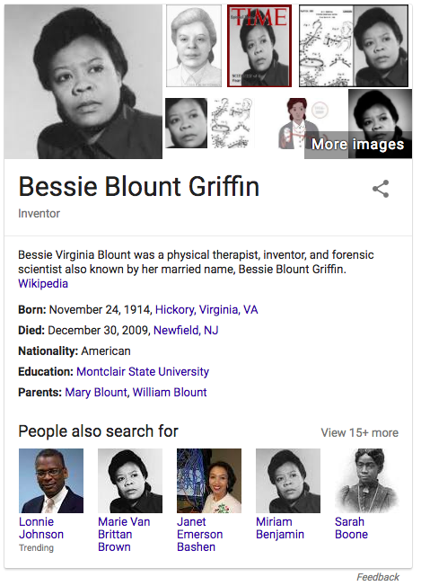
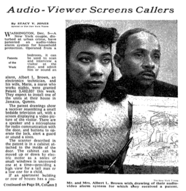

Some people have the privilege to be recognized in our society. We’ve started to resurrect history and tell stories of people whose contributions have been studiously omitted. In America, February is *Black history month*. I didn’t learn Black history in school. I value this time for remedial studies, even as I feel a bit disturbed that we need to aggregate people by race to notice their impact. I had hoped that we, as a society, would have come farther along by now, in treating each other with fairness and respect. Instead, we are encoding our bias about what is noticed and who is recognized.

At the M.I.T. Media Lab, researcher Joy Buolamwini has studied facial recognition software, finding error rates increased with darker skin (via [NYT](https://www.nytimes.com/2018/02/09/technology/facial-recognition-race-artificial-intelligence.html?smid=tw-share)). Specifically, algorithms by Microsoft, IBM and Face++ more frequently failed to identify the gender of black women than white men.

> When the person in the photo is a white man, the software is right 99 percent of the time.  
> But the darker the skin, the more errors arise — up to nearly 35 percent for images of darker skinned women

A lack of judgement in choosing a data set is cast as an error of omission, a small lapse in attention on the part of software developers, yet the persistence of these kinds of errors illustrates a systemic bias. The systems that we build (ones made of code and others made of people) lack checks and balances where we actively notice whether our peers and our software are exercising good judgement, which includes treating people fairly and with respect.

**Errors made by humans are amplified by the software we create.**

The Google “knowledge card” that appears next to the search results for “Bessie Blount Griffen” shows “people also searched for” two other women who are identified with the same photo. It’s hard to tell when the error first appeared, but we can guess that it was amplified by Google search results and perhaps by image search.

I discovered this error first when reading web articles about two different inventors and noticed that the photos used many of the articles were identical. This can be seen clearly in two examples below where the photo is composited with an image of the corresponding patent drawings. The patents were awarded to two unique humans, but somehow we, collectively, blur their individual identities, anonymizing them with a singular black female face.

I found a New York Times article of Marie Van Brittan Brown, and it seems that the oft replicated photo is Bessie Blount Griffen.

Additional confirmation by [@SamMaggs tweet](https://twitter.com/SamMaggs/status/638915645644668928), author of “Wonder Women: 25 Innovators, Inventors, and Trailblazers Who Changed History”

  
source: [Black Then](https://blackthen.com/tag/bessie-blount-griffin/)

  
source: [Circle City Alarm blog](https://circlecityalarm.com/invented-security-system/)

