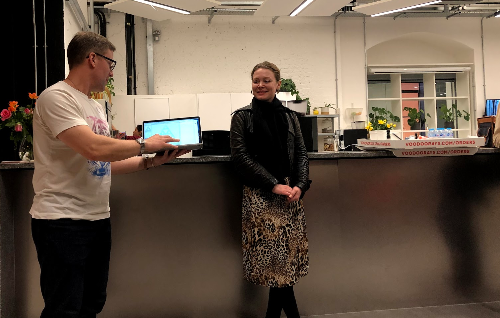
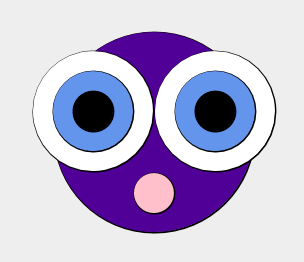

Last night I attended [ScalaBridge London](scalabridgelondon.org). I met one student who had recently studied computer science and decided to focus on Scala because of all of her classes she enjoyed functional programming the most. Another student works with SAS (Statistical Analysis Software) and wanted to learn a new language for her own professional development.

The group was in the middle of a six week series, which is a neat format that they are trying out for the first time. This gives students the chance to get to know each other and work together in a cohort, diving deeper into practicing the language over time.

I was there at the kind invitation of Noel Welsh, since I am visiting London and organizing a [London Bridge event](https://www.eventbrite.com/e/london-bridges-celebrate-tech-inclusion-tickets-61474422653) on May 28th to introduce all of the local groups to each other. I took the opportunity to learn a little Scala too.

The students had progressed to learning structural recursion and one student showed a colorful Sierpinski triangle and explained how she generated the colors. In the photo below, you can see Noel acting as a low-tech projector, holding up the laptop, so the new Scala engineer could talk about her work.



Learning a little Scala coding
------------------------------

At first I was a bit skeptical of using graphics to learn a language which was not designed for that purpose, but the experience won me over. The concrete visualization of code is helpful and I found it as delightful as I did when I first learned basic on an Apple II many years.

I learned that Scala is strongly typed functional programming language that is light on syntax, not requiring characters at the end of statements and whatnot. Using the *SBT console* I made a little drawing, defining my own color purple and creating a value to reuse some code for each eye:

```
val purple = Color.rgb(80.uByte, 0.uByte, 150.uByte)
val eye = circle(10) fillColor Color.black on circle(20) fillColor Color.cornflowerBlue

```

The [Creative Scala](https://www.creativescala.org/creative-scala.html) curriculum uses the [Doodle library](https://github.com/creativescala/doodle) which has easy-to-use layout methods `beside`, `above`, `below`, `on`, and `under`. So I could write `eye beside eye` the same way that I can write `1 + 2`. Like Ruby, operators are methods, and I could have written `eye.beside(eye)` or `1.+(2)`.

I overlaid the two eyes on a blue head, and attempted to create a mouth below:

```
(circle(10) fillColor Color.pink below eye beside eye 
on circle(50) fillColor purple).draw

```


Oops! This was not intentional, and ended up as a sweet graphical illustration of operator precedence — easily fixed by adding parentheses:

```
(circle(10) fillColor Color.pink below (eye beside eye) 
on circle(50) fillColor purple).draw

```



I think my logic error may have been a happy accident, since I think the lop-sided face is more expressive. In any case, the graphics made debugging fun — thanks Noel!