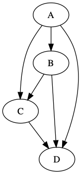

Getting started with Rust and the [petgraph crate](https://docs.rs/petgraph/0.4.13/petgraph/), I made a little program to write a graph in “dot” file format. Below is the rust and some command-line code to turn it into a png.



```
use petgraph::Graph;
use petgraph::dot::{Dot, Config};
use std::fs::File;
use std::io::Write;

fn main() {
    println!("hello graph!");
    let mut graph = Graph::<_, i32>::new();
    graph.add_node("A");
    graph.add_node("B");
    graph.add_node("C");
    graph.add_node("D");
    graph.extend_with_edges(&[
        (0, 1), (0, 2), (0, 3),
        (1, 2), (1, 3),
        (2, 3),
    ]);

    println!("{:?}", Dot::with_config(&graph, &[Config::EdgeNoLabel]));
    let mut f = File::create("example.dot").unwrap();
    let output = format!("{}", Dot::with_config(&graph, &[Config::EdgeNoLabel]));
    f.write_all(&output.as_bytes()).expect("could not write file");
}

```

output of `cargo run`:

```
hello graph!
digraph {
    0 [label="\"A\""]
    1 [label="\"B\""]
    2 [label="\"C\""]
    3 [label="\"D\""]
    0 -> 1
    0 -> 2
    0 -> 3
    1 -> 2
    1 -> 3
    2 -> 3
}

```

Generate PNG from DOT file
--------------------------

The `dot` command is part of [graphviz](https://www.graphviz.org/), which I installed with `brew install graphviz`.

The following command creates a PNG file from the .dot file generated by Rust code above

```
dot -T png -O example.dot

```

The resulting PNG is displayed at the top-right of this post (next to the Rust code).

- - - - - -

Special thanks to:  
\* [mcarton’s help on stackoverflow](https://stackoverflow.com/questions/57540335/writing-petgraph-dot-to-a-file) for enlightening me on a bit of Rust nuance as I experimented with petgraph.  
\* [rudifa’s post graphviz-on-the-mac](https://rudifa.wordpress.com/2010/01/10/how-to-run-graphviz-on-the-mac/)