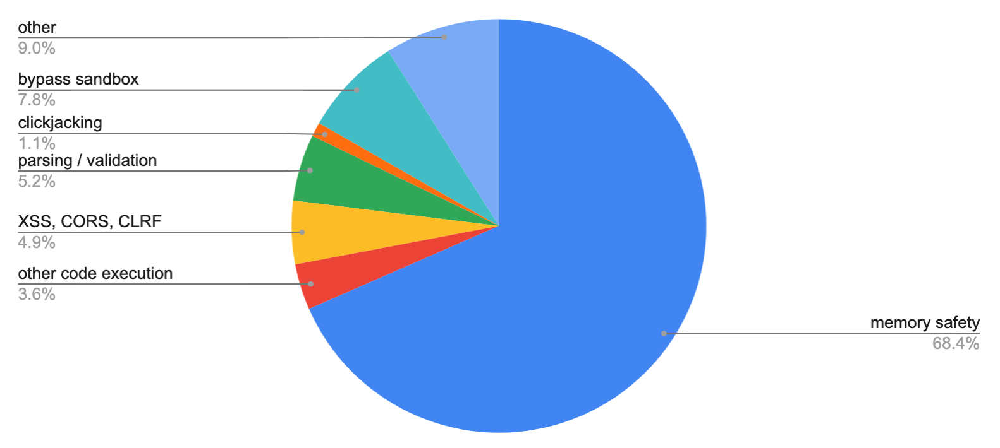
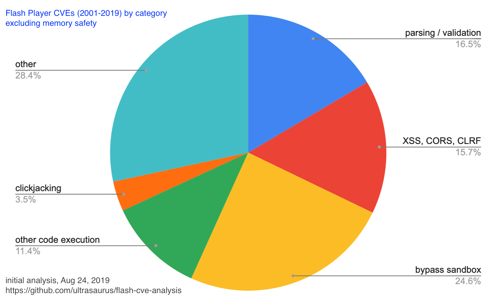

As I think about developing new Internet-connected software, I worry about the safety of the people who use it. By 2021, most Web browsers won’t allow native code extensions, which will eliminate a lot of potential issues, while a hug swath of creative animations and interactives will disappear from the Web. I spent some time this summer, thinking about what I could learn from the security vulnerabilities in the Flash Player that has been much maligned in recent years.

Flash CVEs (2001-2009)
----------------------

I looked at the Common Vulnerabilities and Exposure List ([CVE List](https://cve.mitre.org/data/downloads/index.html) hosted by Mitre with all reports 2001-2019. I found 1172 Flash Player vulnerabilities, which sounds huge, but in context of vulnerabilities reported in Web Browsers, doesn’t look that bad:

- 1172 Flash Player
- 1999 Internet Explorer
- 2033 Chrome
- 2442 Firefox

Note: these numbers don’t necessarily tell us that Firefox had more vulnerabilities than Internet Explorer. It could mean that Firefox was more rigorously open in reporting vulnerabilities, which seems likely.

Understanding attack vectors
----------------------------

Vulnerabilities in the Flash Player were particularly dangerous because Flash was installed on all of the Web Browsers, so any flaw in Flash was much easier to exploit than a flaw in a specific Web Browser. To understand this, one needs to understand that the primary [attack vector](https://www.sumologic.com/glossary/attack-vector/) enabling a hacker to take advantage of a vulnerability in Flash Player was to create a *malicious Flash application or movie* that would distract the user while doing something illicit or intentionally trigger a crash and then exploiting that crash to execute native code with access to the user’s machine.

In the larger context of a specific attack, a vulnerability in the Flash Player would typically need to be combined with something else:  
\* deceptive emails (aka phishing)  
\* deceptive websites  
\* “man in the middle” attacks (replace real Web content with malicious content that appears identical)

Categorizing vulnerabilities
----------------------------

I conducted a rough cut analysis of matching terms by reading the list of CVEs and creating categories that might provide instructive value in thinking through how to avoid similar issues in the future.

- 802 memory safety
- 42 other code execution
- 58 XSS, CORS, CLRF
- 61 parsing / validation
- 13 clickjacking
- 91 bypass sandbox
- 105 other

### Memory safety (~70%)

The vast majority of issues (“memory safety”) resulted from coding errors, which can now be avoided with modern programming languages. For a long time, we’ve been able to use languages like Erlang/Elixir, Java, Python, Ruby, and Go for server-side coding with memory safety features. Even C++ has language features and libraries (though you must choose to use them). Now, for low-profile client software we can use Rust or WebAssembly when we need something higher performance or less memory-hungry than JavaScript.

### Escaping the “sandbox” (~15%)

If we develop code that runs in a Web browser, we can trust the browser’s “sandbox” — our apps can only use a restricted set of APIs. If we’re writing a Web browser or any other Internet-connected software used by humans or machines, then it is a good idea to carefully isolate our code that can access the operating system to write files or make network calls.

From my CVE analysis, coding errors in this category resulted in just over 15% of CVEs (other code execution, bypassing sandbox, and XSS, CORS, CLRF issues). Of course, the biggest thing you can do is not include the code that does powerful things you don’t want to allow. However, sometimes you do need to load and execute a shared library, accessing the filesystem and the network.

### Parsing / Validation (~5% / ~15% excluding memory safety)

Parsing and validation of input (mostly reading a file or parameter) is another common coding error pattern which can result in a serious vulnerability. Having to fix these kinds of issues causes me to be very careful when adding parsing code to any app or library. If we exclude memory safety errors, parsing and validation errors are larger than any identified class of error.

### Clickjacking and “other”

Clickjacking is noteworthy for anyone developing a client app with extensions where 3rd party developers (or other users via content sharing) can present information to the user and allow interaction. This class of attack uses features that are designed to empower users to present compelling content to be instead used to trick people into doing something unintended. For example, there were bugs that allowed Flash content to overlay other web pages or browser UI, thereby tricking the user into clicking or typing in a way to provide privileged access.

Perhaps “other” deserves a closer look, but I didn’t find clear patterns and suspect that contains many smaller categories.

Parsing is hard
---------------

In my experience, many programmers recognize that implementing an extension mechanism that allows for user interaction or providing a “sandbox” for 3rd party code can be very tricky to get right and will exercise great care in writing or using that kind of code. However, I have often interacted with programmers who don’t seem to believe that writing code to parse text is difficult. Writing code that performs the intended action is not hard, but writing code that has no unintended effects requires very careful coding and a little imagination.

Looking toward open source code for some examples to learn from, here are a few examples of URL parsing libraries where bugs were found (and fixed) after vulnerabilities were discovered in the field:

- https://github.com/envoyproxy/envoy/issues/7728 (Envoy proxy)
- https://go-review.googlesource.com/c/go/+/189258/ (Go)
- https://www.cvedetails.com/cve/CVE-2018-3774/ (url-parse Node library)

- - - - - -

The results of this analysis were included as part of Code Mesh LDN 19 talk, A landscape of unintended consequences ([video](https://www.youtube.com/watch?v=pcuNby-MxCo), [slides](https://www.slideshare.net/sarah.allen/internet-security-a-landscape-of-unintended-consequences)). The data and methodology is available at on github: [ultrasaurus/flash-cve-analysis](https://github.com/ultrasaurus/flash-cve-analysis).