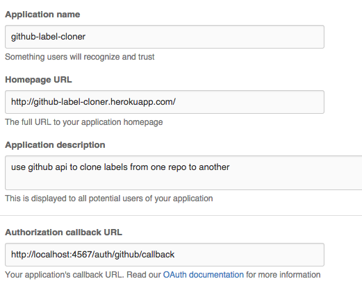

With just three gems in my `Gemfile`

```

source "https://rubygems.org"

gem 'dotenv'
gem 'sinatra'
gem 'sinatra_auth_github'
```

Make the “app” in Github:  


Create a sinatra app. I like to call mine `app.rb`, but it can have any name:

```

require 'sinatra'
require 'dotenv'
require 'sinatra_auth_github'

Dotenv.load

enable :sessions

set :github_options, {
  :scopes    => "user",
  :secret    => ENV['GITHUB_CLIENT_SECRET'],
  :client_id => ENV['GITHUB_CLIENT_ID'],
}

register Sinatra::Auth::Github

get '/' do
  authenticate!
  "Hello there, #{github_user.login}!"
end

get '/logout' do
  logout!
  "good-bye"
end
```

then run it

```

ruby app.rb
```